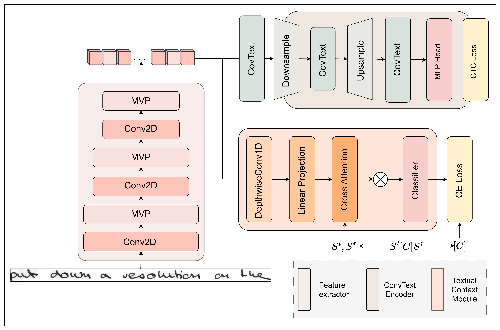

# HTR-ConvText

### Introduction

This is our official implementation for "HTR-Convtext: Using Convolution and Textual Information for Handwritten Text Recognition".

## Table of Contents
- [1. Overview](#1-overview)
- [2. Installation](#2-installation)
- [3. Quick Start](#3-quick-start)
- [4. Acknowledgement](#4-acknowledgement)

## 1. Overview

HTR-ConvText is a data-efficient, hybrid architecture for offline Handwritten Text Recognition that combines the local inductive bias of CNNs with the global context of Vision Transformers. At its core is the ConvText Encoder, a hierarchical design that interleaves Multi-Head Self-Attention with depthwise convolutions to capture both fine-grained stroke details and long-range dependencies. To overcome the linguistic limitations of standard CTC decoding, we introduce Textual Context Module (TCM) that injects surronding characters information into the visual encoder without increasing inference latency. The result is a fast, robust model that achieves state-of-the-art performance on English (IAM), German (READ), Italian (LAM), and complex Vietnamese (HANDS-VNOnDB) datasets without the need for massive synthetic pre-training.



## 2. Installation

### 2.1 Environment

1. **Clone the repository**
   ```cmd
   git clone https://github.com/0xk0ry/HTR-ConvText.git
   cd HTR-ConvText
   ```
2. **Create and activate a Python 3.9+ Conda environment**
   ```cmd
   conda create -n htr-convtext python=3.9 -y
   conda activate htr-convtext
   ```
3. **Install PyTorch** using the wheel that matches your CUDA driver (swap the index for CPU-only builds):
   ```cmd
   pip3 install torch torchvision --index-url https://download.pytorch.org/whl/cu126
   ```
4. **Install the remaining project requirements** (everything except PyTorch, which you already picked in step 3).
   ```cmd
   pip install -r requirements.txt
   ```

The code was tested on Python 3.9 and PyTorch 2.9.1.

### 2.2 Datasets

We provide our split `train.ln`, `val.ln`, and `test.ln` files for each of the dataset used under `data/{iam,read2016,lam,vnondb}/`. Point `--*-data-list` to these paths or duplicate them into your own dataset directory structure.

The structure of the file should be:
```
./data/iam/
├── train.ln
├── val.ln
├── test.ln
└── lines
      ├──a01-000u-00.png
      ├──a01-000u-00.txt
      ├──a01-000u-01.png
      ├──a01-000u-01.txt
      ...
```

**Dataset overview.**

| Dataset   | Training | Validation | Test  | Language    | Charset | Download |
|-----------|---------:|-----------:|------:|-------------|--------:|:--------:|
| IAM       |    6,482 |        976 | 2,915 | English     |      79 | [Source](https://fki.tic.heia-fr.ch/databases/download-the-iam-handwriting-database) |
| READ2016  |    8,349 |      1,040 | 1,138 | German      |      89 | [Source](https://zenodo.org/record/1164045) |
| LAM       |   19,830 |      2,470 | 3,523 | Italian     |      90 | [Source](https://aimagelab.ing.unimore.it/imagelab/page.asp?IdPage=46) |
| VNOnDB    |    4,433 |      1,229 | 1,634 | Vietnamese  |     161 | [Source](https://tc11.cvc.uab.es/datasets/HANDS-VNOnDB_1/) |


**Supported alphabets (`--dataset`).** Character sets and class counts are pre-defined:

| Flag       | Description                  | `nb_cls` |
| ---------- | ---------------------------- | -------- |
| `iam`      | IAM Handwriting Database     | 80       |
| `read2016` | ICDAR 2016 READ lines        | 90       |
| `lam`      | Lam Vietnamese corpus        | 91       |
| `vnondb`   | VNOnDB historical Vietnamese | 162      |


**Custom data checklist.**
1. Arrange line crops and `.txt` files together (one transcript per image).
2. Generate `*.ln` lists pointing to the images; follow the provided templates if you need a reference.
3. Set `--data-path`, `--train-data-list`, `--val-data-list`, and `--test-data-list` accordingly.
4. Extend `data/dataset.py` with your alphabet if it differs from the presets.

## 3. Quick Start

We provide convenient and comprehensive commands in `./run/` to train and test on different datasets, helping researchers reproduce the paper’s results.

### 3.1 Train using provided scripts
- IAM: `bash run/iam.sh`
- READ2016: `bash run/read2016.sh`
- LAM: `bash run/lam.sh`
- VNOnDB: `bash run/vnondb.sh`

Example (Windows cmd.exe, IAM) — flags mirror `run/iam.sh`:
```cmd
python train.py ^
    --use-wandb ^
    --dataset iam ^
    --tcm-enable ^
    --exp-name "htr-convtext" ^
    --wandb-project iam ^
    --num-workers 4 ^
    --max-lr 1e-3 ^
    --warm-up-iter 1000 ^
    --weight-decay 0.05 ^
    --train-bs 32 ^
    --val-bs 8 ^
    --max-span-length 8 ^
    --mask-ratio 0.4 ^
    --attn-mask-ratio 0.1 ^
    --img-size 512 64 ^
    --proj 8 ^
    --dila-ero-max-kernel 2 ^
    --dila-ero-iter 1 ^
    --proba 0.5 ^
    --alpha 1 ^
    --total-iter 100001 ^
    --data-path D:/datasets/iam/lines/ ^
    --train-data-list D:/datasets/iam/train.ln ^
    --val-data-list D:/datasets/iam/val.ln ^
    --test-data-list D:/datasets/iam/test.ln ^
    --nb-cls 80
```

### 3.2 Evaluate checkpoints
- Use the matching test script in `./run/` or call `test.py` directly:
```cmd
python test.py ^
    --resume ./best_CER.pth
    --use-wandb ^
    --dataset iam ^
    --tcm-enable ^
    --exp-name "htr-convtext" ^
    --wandb-project iam ^
    --num-workers 4 ^
    --max-lr 1e-3 ^
    --warm-up-iter 1000 ^
    --weight-decay 0.05 ^
    --train-bs 32 ^
    --val-bs 8 ^
    --max-span-length 8 ^
    --mask-ratio 0.4 ^
    --attn-mask-ratio 0.1 ^
    --img-size 512 64 ^
    --proj 8 ^
    --dila-ero-max-kernel 2 ^
    --dila-ero-iter 1 ^
    --proba 0.5 ^
    --alpha 1 ^
    --total-iter 100001 ^
    --data-path D:/datasets/iam/lines/ ^
    --train-data-list D:/datasets/iam/train.ln ^
    --val-data-list D:/datasets/iam/val.ln ^
    --test-data-list D:/datasets/iam/test.ln ^
    --nb-cls 80
```

## 4. Acknowledgement
This repo and project was inspired and adapted from [HTR-VT](https://github.com/Intellindust-AI-Lab/HTR-VT)

We gratefully acknowledge the authors for making their work publicly available, which has greatly supported the development of our project.